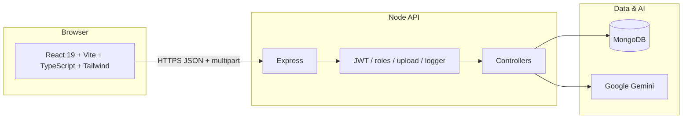

# CampusFlow AI

A **production-style campus collaboration platform** that combines **social feed**, **placement workflows**, **events**, **personal tasks**, and **Google Gemini** behind a single JWT-secured API. The product targets student life—with **admin** and **recruiter** roles—so one codebase can support day-to-day campus operations and hiring touchpoints without fragmenting tools.

---

## Why this project is different

| Angle | What you get |
|--------|----------------|
| **Unified “campus OS”** | Feed, placements, calendar-style events, tasks, profile, and AI are **one** authenticated experience—not separate spreadsheets and chat threads. |
| **Trust & roles** | **JWT** auth with **`student` · `admin` · `recruiter`**. Server-side checks gate **event creation** (admin), **placement publishing** (admin + recruiter), and **applications** (students only). |
| **Verified signup** | **Email OTP** registration (Nodemailer) reduces fake accounts; dev-friendly fallback logs OTP when SMTP is unset. |
| **AI done responsibly** | The browser **never** holds the Gemini key. All generation goes through **`POST /api/ai/generate`** with optional modes (roadmap, projects, tasks, resume feedback). |
| **Real collaboration data** | Posts support **categories**, **likes**, **threaded comments**, **image uploads**, and **owner/admin delete**—not a static mock UI. |
| **Engineering hygiene** | Clear **MVC-style** backend layout, **TypeScript** frontend, **Axios** service layer, **correlation-style request logging**, structured errors, and **deployment-minded** split (API + static SPA). |

---

## High-level architecture



- **Frontend** talks only to **`VITE_API_URL`** (e.g. `http://localhost:5000/api`). Tokens live in **`localStorage`** and attach as **`Authorization: Bearer`**.
- **Backend** owns secrets (**`JWT_SECRET`**, **`GEMINI_API_KEY`**, SMTP), validation, and authorization.
- **MongoDB** stores users, posts, tasks, placements (+ applications), events (+ attendees), and short-lived OTP records.

---

## Repository layout

```text
hackathon-2026/
├── backend/
│   ├── config/           # DB connection (e.g. standalone Mongo tuning)
│   ├── controllers/      # Route handlers (thin → models/utils)
│   ├── middleware/     # auth (JWT + role), uploads, errors, request logger
│   ├── models/         # Mongoose schemas
│   ├── routes/         # HTTP surface mounted under /api/*
│   ├── utils/          # token, mailer, logger, email templates
│   ├── uploads/        # Created at runtime for post images
│   ├── server.js       # Express app entry
│   └── .env.example
├── frontend/
│   ├── src/
│   │   ├── components/     # Shell UI (sidebar, top bar, protected route)
│   │   ├── context/       # AuthProvider + session bootstrap
│   │   ├── layouts/       # MainLayout (sidebar + outlet)
│   │   ├── pages/         # Feature screens (TSX)
│   │   ├── services/      # Axios client + API helpers
│   │   ├── types/         # Shared DTO-style types
│   │   ├── App.tsx
│   │   └── main.tsx
│   ├── index.html
│   ├── vite.config.ts
│   ├── tailwind.config.js
│   └── .env.example
├── PROJECT_TASKS.md      # Optional internal checklist
└── README.md               # (this file)
```

---

## Feature catalog

### Authentication & profile

| Feature | Detail |
|---------|--------|
| Register with OTP | `POST /api/auth/register-otp` → email code; `POST /api/auth/register` completes signup with **name, email, password, role, otp**. |
| Login | `POST /api/auth/login` → JWT + user payload (`bio`, `skills` included). |
| Session | `GET /api/auth/me` refreshes identity after reload. |
| Profile | `PATCH /api/auth/profile` updates **name**, **bio**, **skills** (self-service). |
| Protection | All app routes except login/register require a valid JWT. |

### Dashboard

Aggregated view for the signed-in user: welcome copy, **upcoming events**, **recent personal tasks**, **latest placements** (with **postedBy** populated: name + role), and **curated AI suggestion strings**—plus navigation shortcuts.

### Collaboration feed

| Capability | Detail |
|------------|--------|
| Read | All authenticated roles see the **same** global feed (newest first). |
| Create | Text + required **category**: `Placement`, `Projects`, `Learning`, `Clubs`; optional **image** (`multipart`). |
| Engage | **Like** (toggle), **comment**, view counts. |
| Moderate | Author may delete; **admin** may delete any post. |
| UX | Category filters; **admin** badge on posts when author role is admin. |

### Tasks

Personal CRUD for the owner: list, create, update (including **completed**), delete—scoped by **`owner`** in the database.

### Placements

| Role | Capability |
|------|------------|
| **Student** | List all openings; **apply** with a **resume URL** (`POST .../apply`). |
| **Admin / recruiter** | **Create** listings (title, company, description); responses include **postedBy** populated for transparency. |
| UI | “Campus admin” / “Recruiter” chips + “Posted by …” line on cards; dashboard highlights **admin**-posted items. |

### Events & clubs

| Capability | Detail |
|------------|--------|
| List / join | Any authenticated user can list and **RSVP** (`join`). |
| Create | **Admin-only** event creation (title, description, datetime). |
| Data | Attendees stored on the event document; organizer populated where applicable. |

### AI assistant

| Mode (`type`) | Purpose |
|---------------|---------|
| `roadmap` | Learning path from a goal |
| `project` | Project ideas |
| `tasks` | Prioritized task list |
| `resume` | Resume-style feedback |

Implemented via **`@google/generative-ai`**; model defaults to **`gemini-2.5-flash`** (override with **`GEMINI_MODEL`**). Blocked or empty model outputs return a **502** with **`finishReason` / safety metadata** when the API exposes them.

### Administration

| Feature | Detail |
|---------|--------|
| User directory | `GET /api/users` — **admin-only**; returns sanitized users (`id`, name, email, role, bio, skills). |

---

## Data model (MongoDB / Mongoose)

| Collection | Highlights |
|------------|------------|
| **User** | Credentials, **`role`**, **bio**, **skills** |
| **Post** | Author, content, **category**, **imageUrl**, likes[], embedded **comments** |
| **Task** | **owner**, title, description, **completed** |
| **Placement** | Job fields, **postedBy**, **applications[]** (applicant + resumeUrl) |
| **Event** | Scheduling, **createdBy**, **attendees[]** |
| **RegisterOtp** | Hashed code + **TTL** style expiry for signup |

---

## API quick reference

Base URL: **`/api`** (e.g. `http://localhost:5000/api`).

| Area | Methods | Notes |
|------|---------|--------|
| **Auth** | `POST /auth/register-otp`, `POST /auth/register`, `POST /auth/login`, `GET /auth/me`, `PATCH /auth/profile` | Bearer on protected routes |
| **Dashboard** | `GET /dashboard` | |
| **Posts** | `GET|POST /posts`, `PATCH /posts/:id/like`, `POST /posts/:id/comment`, `DELETE /posts/:id` | POST uses **multipart** for optional `image` |
| **Tasks** | `GET|POST /tasks`, `PUT|DELETE /tasks/:id` | |
| **Placements** | `GET /placements`, `POST /placements`, `POST /placements/:id/apply` | Create: **admin+recruiter**; Apply: **student** |
| **Events** | `GET /events`, `POST /events`, `POST /events/:id/join` | Create: **admin** |
| **AI** | `POST /ai/generate` | Body: `{ type, input }` |
| **Users** | `GET /users` | **Admin** only |

Static uploads: **`GET /uploads/<file>`** (served from `backend/uploads`).

---

## Environment variables

### Backend (`backend/.env`)

See **`backend/.env.example`**. Minimum:

- **`MONGO_URI`** — Mongo connection string (standalone setups are handled with compatible driver options in code where needed).
- **`JWT_SECRET`** — signing secret for JWTs.
- **`GEMINI_API_KEY`** — Google AI Studio / Gemini API key.
- **`GEMINI_MODEL`** *(optional)* — defaults to **`gemini-2.5-flash`**.

**Email OTP (production):**

- **`SMTP_HOST`**, **`SMTP_PORT`**, **`SMTP_SECURE`**, **`SMTP_USER`**, **`SMTP_PASS`**, **`EMAIL_FROM`**
- Use **no spaces around `=`** in `.env`. **Gmail**: 2FA + **App Password**; **`EMAIL_FROM`** should match **`SMTP_USER`**.

### Frontend (`frontend/.env`)

- **`VITE_API_URL=http://localhost:5000/api`** (include the **`/api`** suffix used by this codebase).

---

## Local development

**Terminal 1 — API**

```bash
cd backend
cp .env.example .env   # then edit values
npm install
npm run dev              # or: npm start
```

Default: **`http://localhost:5000`**.

**Terminal 2 — SPA**

```bash
cd frontend
cp .env.example .env     # optional; set VITE_API_URL
npm install
npm run dev
```

Default: **`http://localhost:5173`**.

**Production build (frontend)**

```bash
cd frontend
npm run build            # tsc + vite → dist/
npm run preview          # optional local static preview
```

---

## Deployment orientation

- **Frontend**: static **`dist/`** on **Vercel**, **Netlify**, **Cloudflare Pages**, or any CDN—set **`VITE_API_URL`** to the public API base (…`/api`).
- **Backend**: **Railway**, **Render**, **Fly.io**, etc.—set the same env vars as local; ensure **CORS** allows your SPA origin if not same-domain.
- **MongoDB**: Atlas or self-hosted; use a single **`MONGO_URI`** for the API process.

---

## Scripts

| Location | Command | Purpose |
|----------|---------|---------|
| `backend/` | `npm run dev` | Nodemon on `server.js` |
| `backend/` | `npm start` | Production-style `node server.js` |
| `frontend/` | `npm run dev` | Vite dev server (port **5173**) |
| `frontend/` | `npm run build` | Typecheck + production bundle |
| `frontend/` | `npm run lint` | ESLint |

---

## License / attribution

Use and extend per your hackathon or organization policy. Third-party logos and remote hero images in the UI are for demonstration; swap assets for production branding.

---

**Built as CampusFlow AI** — one stack for **campus collaboration**, **career workflows**, and **AI-assisted productivity**, with **clear boundaries** between client, API, data, and external intelligence.
